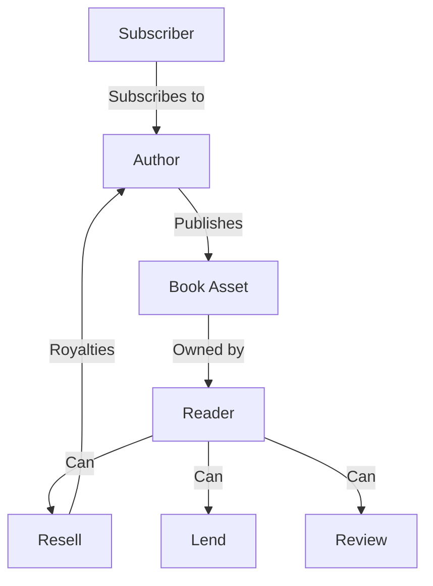

# TokenScribe Publishing Platform

A decentralized publishing platform that empowers authors to publish and monetize their e-books directly on the Stacks blockchain.

## Overview

TokenScribe revolutionizes digital publishing by eliminating traditional intermediaries and enabling direct author-to-reader relationships. The platform allows authors to:

- Publish and mint their e-books as digital assets
- Set custom pricing and royalty rates
- Receive automatic royalty payments for resales
- Create subscription-based content offerings

Readers benefit from:

- Verifiable ownership of digital books
- Ability to resell purchased books
- Direct support of favorite authors
- Book lending capabilities
- Review and rating system

## Architecture



The platform is built on a single main smart contract that handles:

- Book asset management and ownership
- Purchase and transfer logic
- Royalty calculations and distributions
- Lending system
- Review/rating system
- Author subscriptions

## Contract Documentation

### Core Functionalities

#### Book Publishing and Management
- Authors can publish books with customizable parameters
- Books can be priced, with a minimum price of 1 STX
- Royalty rates can be set up to 30%
- Authors can toggle resale permissions

#### Purchase and Transfer
- Readers can purchase books directly
- Smart royalty distribution for resales
- Built-in protections against self-dealing
- Ownership tracking and verification

#### Lending System
- Owners can temporarily lend books to others
- Time-based lending with automatic expiration
- Early return functionality

#### Reviews and Ratings
- Verified owners can leave reviews
- 5-star rating system
- Aggregate rating calculations

#### Subscription System
- Authors can create subscription offerings
- Readers can subscribe to authors
- Automatic subscription management

### Access Control

- Book content access restricted to owners and authorized borrowers
- Price updates limited to current owners
- Resale permission toggles limited to authors
- Reviews limited to verified owners
- Subscription management controlled by authors

## Getting Started

### Prerequisites

- Clarinet installed
- Stacks wallet for deployment and testing

### Basic Usage

#### Publishing a Book

```clarity
(contract-call? .tokenscribe publish-book 
    "Book Title"
    "Description"
    "cover-url"
    <content-hash>
    u1000000 ;; 1 STX
    u150     ;; 15% royalty
    true     ;; Allow resale
)
```

#### Purchasing a Book

```clarity
(contract-call? .tokenscribe purchase-book u1)
```

#### Lending a Book

```clarity
(contract-call? .tokenscribe lend-book 
    u1 
    'BORROWER-ADDRESS 
    u1440 ;; Duration in blocks
)
```

## Function Reference

### Author Functions

```clarity
(publish-book (title) (description) (cover-url) (content-hash) (price) (royalty) (resale-allowed))
(update-book-price (book-id) (new-price))
(toggle-resale-permission (book-id))
(create-subscription (price) (description))
```

### Reader Functions

```clarity
(purchase-book (book-id))
(lend-book (book-id) (borrower) (duration))
(return-book (book-id))
(review-book (book-id) (rating) (review-text))
(subscribe-to-author (author))
```

### Read-Only Functions

```clarity
(get-book-public-details (book-id))
(get-book-content-hash (book-id))
(check-book-access (book-id))
(get-author-books (author))
(get-reader-books (reader))
(get-book-rating (book-id))
(check-subscription (reader) (author))
```

## Development

### Testing

1. Clone the repository
2. Install dependencies: `clarinet install`
3. Run tests: `clarinet test`

### Local Development

1. Start local chain: `clarinet start`
2. Deploy contract: `clarinet deploy`

## Security Considerations

### Limitations

- Book content is stored off-chain; only content hashes are stored on-chain
- Maximum of 100 books per author/reader list
- Fixed lending duration once set
- One review per user per book

### Best Practices

- Always verify book ownership before transactions
- Check subscription status before accessing subscription-only content
- Validate all input parameters
- Handle STX transfers with proper error checking
- Respect lending periods and permissions